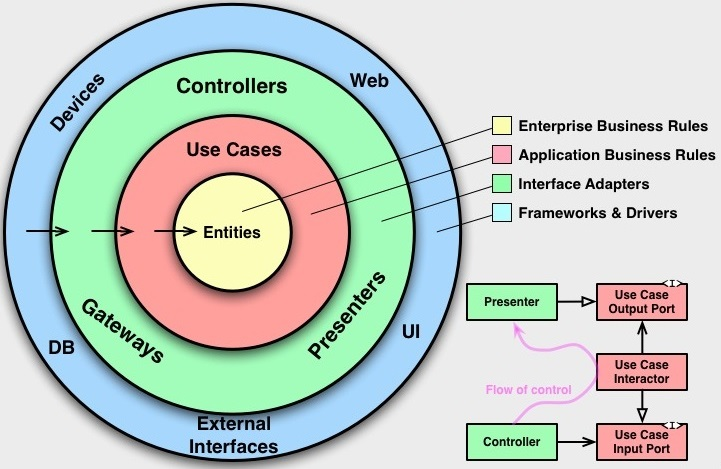

# Architecture

This section contains the suggested solution and all the architecture definitions.

##  Table of Contents

* [Email Microservice](../README.md#email-microservice---uber-code-challenge-for-back-end)
    * [Comments](../README.md#comments)
    * [Guides](../README.md#guides)
    * [Announcements](../README.md#announcements)
    * [License](../README.md#license)
* [Discovery](./Discovery.md)
    * [Emails Provider](./Discovery.md#emails-provider)
    * [Business Rules](./Discovery.md#business-rules)
* Architecture
    * [Design and architectural decisions](#design-and-architectural-decisions)
    * [Features Presentation](#features-presentation)
        * [Strategic modeling with DDD](#strategic-modeling-with-ddd-domain-driven-design)
        * [Clean Architecture](#clean-architecture)
        * [Test Pyramid](#test-pyramid)
    * [Tech Stack](#tech-stack)
    * [Standards and conventions](#standards-and-conventions)

## Design and architectural decisions

- Architecture based on microservices;
- Microservices can be replaced for others with technology different;
- Each microservice will have its own CI/CD process;
- Horizontal scalability:
    * The scaling process can be configured at a microservice level;
    * All microservices will work in a "Stateless" way;
    * The scaling process will involve increasing the number of Kubernetes PODs;
    * The autoscaling process will also be used through an HPA (Horizontal Pod Autoscaler) feature;
- Service discovery:
    * There will be no need to work with a Service Discovery system such as "Consul";
    * The project will use Kubernetes to orchestrate the containers, so Service Discovery is already part of the process;
- Messaging:
    * As part of the communication between the microservices is asynchronous, a messaging system is required;
    * RabbitMQ was chosen for this case;
    * Why not Apache Kafka or Amazon SQS, among others?
        * As we will only be using the messaging feature for this solution, the project would be using very little of what Apache Kafka has to offer;
- Resilience and self-healing:
    * To ensure resilience if one or more microservices go down, queues will be essential;
    * If a message comes in a pattern that is not expected for a particular microservice, the microservice may reject it and it may automatically be forwarded to a dead-letter queue;
    * Because Kubernetes has Circuit Breaker, Liveness and Readiness probes:
        * If a container fails, it will be automatically restarted or even recreated;
        * If a container can't handle a certain amount of traffic, we have the option of working with Circuit Breaker to prevent it from receiving any more requests while it's recovering;
    * The emails will be saved in a NoSQL database, so we can adopt the strategy that if we need to reprocess the emails, we can just retrieve them from the database;
    * For this first project, we will save emails for a month and then evaluate whether we can reduce the time or increase it, based on the metrics of the service's use;

## Features Presentation

### Strategic modeling with DDD (Domain-Driven Design).

**Tactical Design:** (Value Objects / Aggregates and Entities / Domain Services / Factories):
- Domain services are widely used, but in this project I will use the **Clean Architecture** that makes use of use cases. 
- **Value Objects:** They enable us to measure, quantify and describe something in our domain. These are immutable, light-weight objects that don’t have any identity.
    Examples: (Identifier, Name, Money, Date)
- **Aggregates:** Basically, they are the root entities of our project, core entities that live on their own.

### A short explanation of the difference between Entities and Aggregates:

**Entity:**

- An entity is an object that has a distinct identity and is defined by its unique identifier;
- Identity is a key aspect, and two entities with the same identity are considered equal, regardless of other attribute values;
- Entities have a lifecycle and can be created, modified, and deleted;
- They encapsulate behavior and hold state, and changes to their state are typically tracked;

**Aggregate:**

- An aggregate is a cluster of associated objects treated as a single unit for data changes;
- It is composed of one or more entities and value objects;
- The aggregate has a root entity, known as the aggregate root, which is responsible for managing the consistency of the entire aggregate;
- Changes within the aggregate are controlled through the aggregate root, and external entities access the aggregate through the root;
- Aggregates are defined based on transactional consistency boundaries and are designed to ensure that the aggregate remains in a consistent state;

In summary, while entities represent individual objects with identity and a lifecycle, aggregates are groups of related entities and value objects treated as a single unit. Aggregates are designed to maintain consistency boundaries and ensure that data changes within the aggregate are performed in a controlled and consistent manner. The aggregate root is the entry point for external access and modification of the aggregate's state.

## Clean Architecture

That's what's great about DDD, because it doesn't force an application architecture on us, so we use the concepts and strategies of DDD and together we use an application architecture with Clean Architecture.

The concept behind this is basically that we can receive and separate everything the domain and use cases infrastructure.

**Example:** If we decide to switch from the Spring framework to Quarkus, there's no problem because we don't need to change our domains or use cases.

**Screaming Architecture**

- Software's architecture should scream the intent of the system, hence the name screaming architecture. We do this by organizing our architecture around the use cases of the system;
- The screaming architecture practice can best be explained using a metaphor about the architecture of buildings. In buildings the blueprints represents the intent of the architecture. Let's take a look the following blueprint of a house;

## Test Pyramid

**Unit:**

- These are tests that check that a certain part of the code works, regardless of whether there are integrations or not;
- The unit test will always be defined as the smallest testable part of your project, it can be a method of a class, a function and so on;
- They are extremely fast because they don't depend on frameworks and are the test we find most often in the application;

**Integration:**

- The purpose of this test is to check whether two or more interacting units are working as expected;
- It is generally used to test some of the functionality of the system integrated into the framework in isolation. You'll find many tests integrated in the application's infrastructure layer;
- Examples of integrated tests:
    * Checking that the framework is bind the request correctly;
    * Checking that the repositories are doing the queries correctly;
    * Checking that HTTP calls are being made correctly;

**E2E (End To End)**

- These are tests that simulate the user in a real environment, i.e. they simulate the whole process of a user opening a browser, filling in forms, sending requests to a server, etc;
- In the context of an API (microservice), I'll use the name E2E for tests that run throughout the application and simulate the user from calls on the endpoints;

The test automation pyramid captures the essence that each type of test becomes more costly the further up the pyramid we go. As a result, we want to have a large number of low costs tests and a small number of high cost tests.

## Tech Stack

1. [C4-PlantUML](https://github.com/plantuml-stdlib/C4-PlantUML/tree/master)
2. JDK 17
3. IDE's (IntelliJ IDEA / Visual Studio Code)
4. [Apache Maven 3.6.3](https://maven.apache.org/download.cgi)
5. [Spring Boot](https://spring.io/projects/spring-boot/)
6. [MongoDB](https://www.mongodb.com/)
7. [Docker](https://www.docker.com/)
8. RabbitMQ
9. [Git / GitHUB](https://github.com/ecr-developer/uber-challenge-email)
10. [CI/CD - GitActions](https://docs.github.com/en/actions)
11. [Sonar](https://www.sonarsource.com/open-source-editions/)

## Standards and conventions

- [Google Java Style Guide](https://google.github.io/styleguide/javaguide.html)
- [Conventional Commits](https://www.conventionalcommits.org/en/v1.0.0/)
- Repository - Here's a simplified overview of the process:

    1. **Development Branch (main):**
        * Ongoing development and new features are added to this branch;
    2. **Release Branch (release/1.0.0):**
        * Created from the development branch when preparing for a release;
        * Bug fixes and final adjustments for the release are made on this branch;
        * Testing is often conducted on this branch to ensure stability;
    3. **Merge to Main:**
        * When the release is ready, changes from the release branch will be merged back into the main branch, only accepted via Pull Request;
    4. **Tagging the Release:**
        * A tag may be created on the main branch to mark the specific commit that represents the release (v1.0.0);