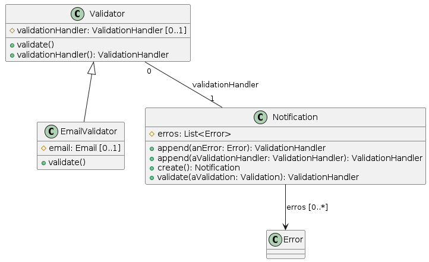

# [CHAP-106] Refinement the business rules validations

### **Email Domain:** [CHAP-103](./Chap103.md#email-domain)

"An object that collects together information about errors and other information in the domain layer and communicates it to the presentation."
**by Martin Fowler**

## **Business Rules:**

* AccountId must not be null or empty;
* EmailFrom must not be null or empty;
* EmailFrom must be valid;
* EmailTo must not be null or empty;
* EmailTo must be valid;
* EmailTo can have one or more emails;
* Content can be null or empty;

### **Tech Refinement:**

Add commons-validator as a dependency to check if the email is valid.

Lirary: Apache Commons Validator
License: Apache 2.0
Version: 1.8.0